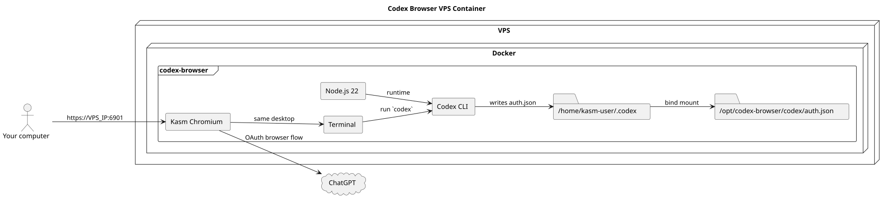

# codex-browser



Single-container Kasm deployment for Chromium, Node.js 22, and `@openai/codex`.
The container is meant to open on a VPS at `https://VPS_IP:6901`, run the
Codex CLI in the desktop terminal, and persist the login state as
`./codex/auth.json` on the host.

If the repo is deployed at `/opt/codex-browser`, the durable login file is
`/opt/codex-browser/codex/auth.json`.

## Layout

- `Dockerfile` - Kasm Chromium base image plus Node.js 22 and Codex CLI
- `docker-compose.yml` - runtime wiring for port `6901` and the persisted auth volume
- `scripts/docker-build.sh` - build wrapper around `docker build`
- `docs/architecture/codex-browser.md` - runtime and persistence overview
- `docs/deployment/vps.md` - build, run, and login steps

## Quick Start

```bash
./scripts/docker-build.sh codex-browser:local .
docker compose up -d
```

Then open `https://VPS_IP:6901`, start a terminal in the Kasm desktop, run
`codex`, and choose `Sign in with ChatGPT`.
